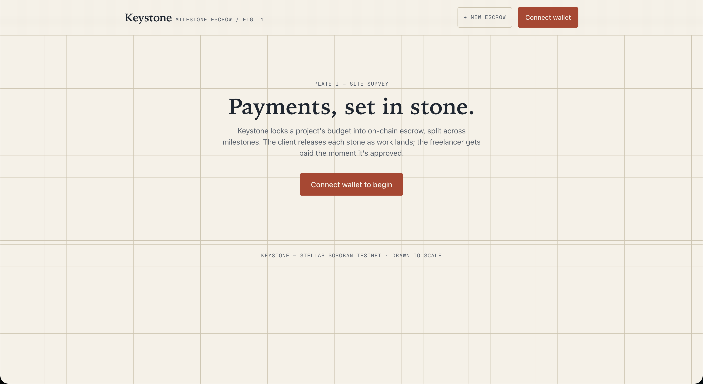
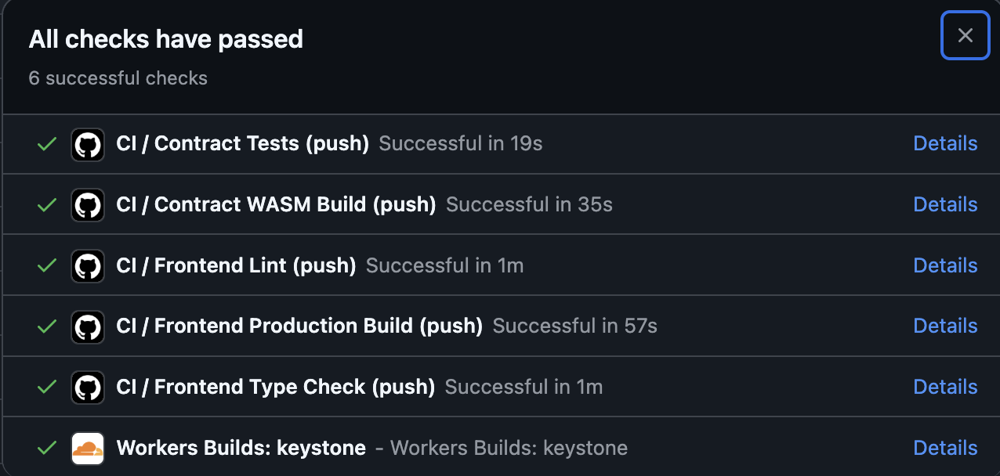
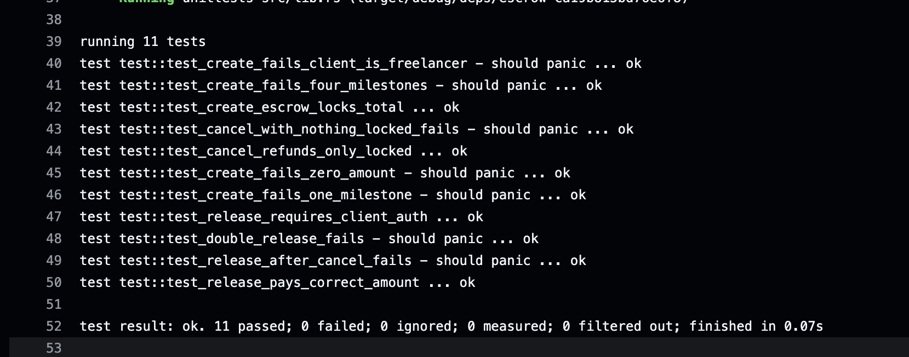
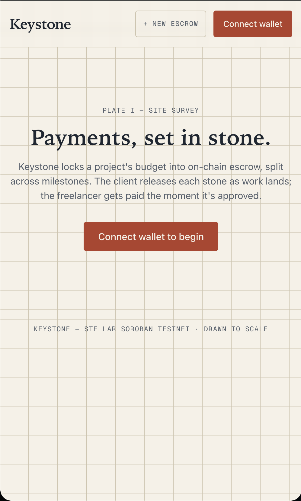
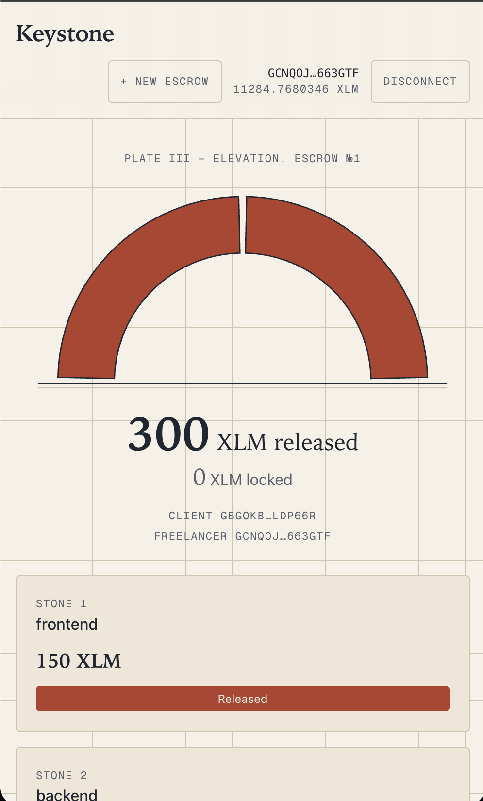
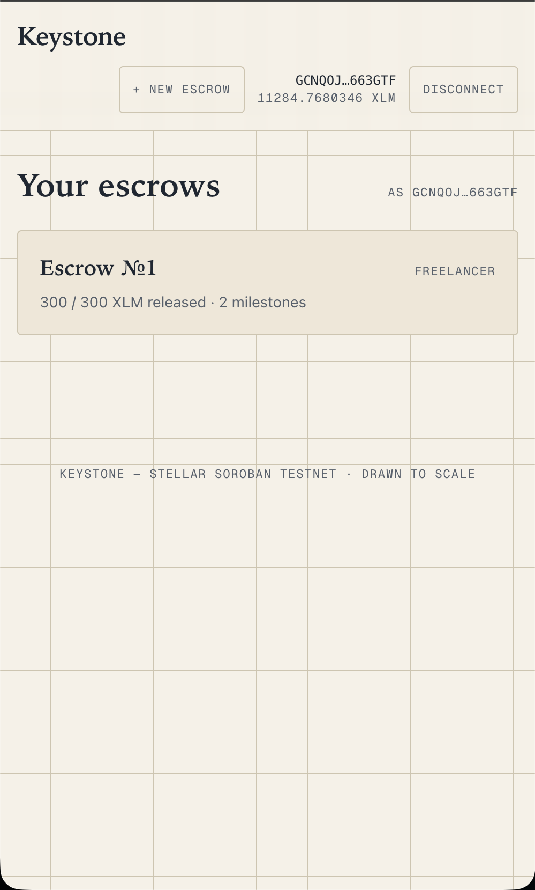
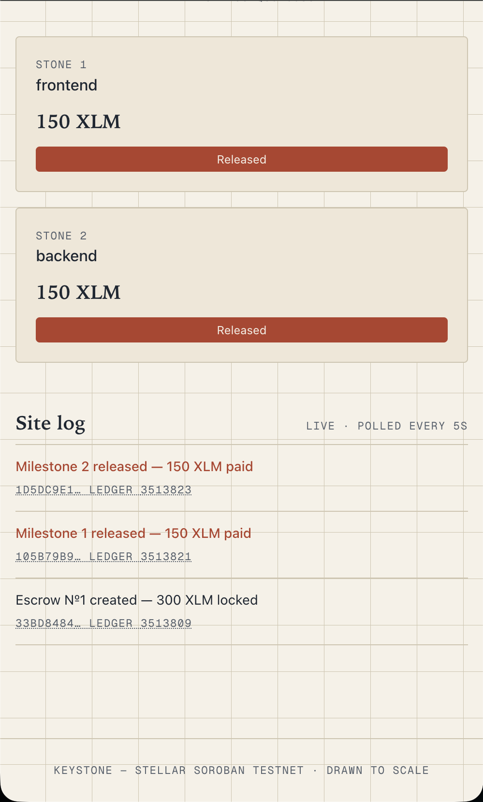

<div align="center">

# 🗝️ Keystone — Milestone Escrow on Stellar Soroban

[](https://github.com/benr246/Keystone/actions/workflows/ci.yml)
[](https://stellar.org)
[](https://developers.stellar.org/docs/build/smart-contracts)
[](https://nextjs.org)
[](https://www.typescriptlang.org)
[](LICENSE)

**Milestone-based escrow for client/freelancer payments on Stellar Testnet — funds locked in Soroban smart-contract custody and released one stone at a time, with verifiable on-chain inter-contract transfers.**

### 🔗 [Live Demo → keystone.swore-fetch-sank.workers.dev](https://keystone.swore-fetch-sank.workers.dev/)

</div>

Keystone is a milestone-based escrow dApp on Stellar testnet. A client locks the full budget of a project into a Soroban smart contract, split across 2–3 named milestones for a designated freelancer. As the client approves each milestone, the escrow contract executes a real inter-contract transfer (Escrow → Stellar Asset Contract) paying that milestone to the freelancer. If the client cancels, every still-locked milestone is refunded on-chain — already-released payments are untouched.



## Table of Contents

- [Live Demo](#live-demo)
- [Demo Video (1–2 minutes)](#demo-video-12-minutes)
- [Architecture](#architecture)
- [Tech Stack](#tech-stack)
- [Contract Deployment Address](#contract-deployment-address)
- [Transaction Hash for Contract Interaction](#transaction-hash-for-contract-interaction)
- [Inter-Contract Communication](#inter-contract-communication)
- [Event Streaming & Real-Time Updates](#event-streaming--real-time-updates)
- [Escrow Mechanics](#escrow-mechanics)
- [Smart Contract Deployment Workflow](#smart-contract-deployment-workflow)
- [CI/CD Pipeline](#cicd-pipeline)
- [Tests](#tests)
- [Error Handling & Loading States](#error-handling--loading-states)
- [Mobile Responsive Frontend](#mobile-responsive-frontend)
- [Production-Ready Architecture](#production-ready-architecture)
- [Setup Instructions](#setup-instructions)
- [Project Structure](#project-structure)
- [Commit History Summary](#commit-history-summary)
- [Screenshots](#screenshots)
- [License](#license)

## Architecture

```
┌───────────────────────────────────────────────────────────────┐
│                     Next.js 14 Frontend                       │
│        (static export · Tailwind · SWR 5s polling)            │
│                                                               │
│   ┌─────────────┐  ┌──────────────┐  ┌───────────────────┐   │
│   │  Dashboard  │  │ Create flow  │  │ Escrow detail     │   │
│   │  (escrows)  │  │ (lock funds) │  │ (arch hero + feed)│   │
│   └──────┬──────┘  └──────┬───────┘  └─────────┬─────────┘   │
└──────────┼────────────────┼────────────────────┼─────────────┘
           │   StellarWalletsKit (Freighter et al.)
           ▼                ▼                    ▼
┌───────────────────────────────────────────────────────────────┐
│              Soroban RPC · Stellar Testnet                    │
│                                                               │
│   ┌──────────────────────┐  inter-contract  ┌─────────────┐  │
│   │   Escrow contract    │      calls       │ Native XLM  │  │
│   │  CA62…2SQO           │ ───────────────► │ SAC (token) │  │
│   │  create / release /  │  token.transfer  │ CDLZ…CYSC   │  │
│   │  cancel + events     │                  │             │  │
│   └──────────────────────┘                  └─────────────┘  │
└───────────────────────────────────────────────────────────────┘
```

## Tech Stack

| Layer | Technology |
|---|---|
| Smart contracts | Rust + Soroban SDK v25 |
| Frontend | Next.js 14 (App Router), TypeScript 5, static export |
| Styling | Tailwind CSS (architectural-blueprint visual identity) |
| Animation | Framer Motion (arch segment transitions) |
| Wallet | `@creit.tech/stellar-wallets-kit` v2.5 (Freighter primary) |
| Data fetching | SWR (5s polling of contract state + events) |
| Chain access | `@stellar/stellar-sdk` v16 (Soroban RPC + Horizon) |
| Deployment | Cloudflare Workers static assets (`wrangler.toml`) |
| CI/CD | GitHub Actions (contracts + frontend jobs) |
| Network | Stellar Testnet, funded via Friendbot |

## Live Demo

**<https://keystone.swore-fetch-sank.workers.dev/>** — deployed on Cloudflare Workers, wired to the real testnet contract. Connect Freighter (testnet), create an escrow, release stones, watch the arch fill live.

## Demo Video (1–2 minutes)

**[▶ Watch the full demo (MP4)](screenshots/demo.mp4)** — connect wallet → create a 2-milestone escrow (300 XLM locked) → release both milestones → live arch + activity feed updating from on-chain events.

Preview:


## Contract Deployment Address

| Contract | Address | Explorer |
|---|---|---|
| Escrow | `CA62WWTOFZQIYWXQHZUOAXF3ZB5IB3AS6N7RYYXGG4YK6M3NJ6OK2SQO` | [Stellar Expert](https://stellar.expert/explorer/testnet/contract/CA62WWTOFZQIYWXQHZUOAXF3ZB5IB3AS6N7RYYXGG4YK6M3NJ6OK2SQO) |
| Native XLM SAC (token) | `CDLZFC3SYJYDZT7K67VZ75HPJVIEUVNIXF47ZG2FB2RMQQVU2HHGCYSC` | [Stellar Expert](https://stellar.expert/explorer/testnet/contract/CDLZFC3SYJYDZT7K67VZ75HPJVIEUVNIXF47ZG2FB2RMQQVU2HHGCYSC) |

## Transaction Hash for Contract Interaction

All three hashes are real, executed on Stellar testnet, and resolve on Stellar Expert:

| Action | Transaction hash |
|---|---|
| `create_escrow` (3 milestones, 500 XLM locked) | [`03bb53cfdec76d0a3957b1a243a412e848545d5f694be35d47bd750c8c38a122`](https://stellar.expert/explorer/testnet/tx/03bb53cfdec76d0a3957b1a243a412e848545d5f694be35d47bd750c8c38a122) |
| `release_milestone(0, 0)` (100 XLM paid to freelancer) | [`02ebf6eea4de81bbe3fa4442369ff7b5e88b0c05974f883347de34792f6e578f`](https://stellar.expert/explorer/testnet/tx/02ebf6eea4de81bbe3fa4442369ff7b5e88b0c05974f883347de34792f6e578f) |
| `cancel_escrow(0)` (400 XLM refunded to client) | [`815aea33524aaec8553b10ca0ef4958f1dc5967cbec59d9faac33fb208f8bf05`](https://stellar.expert/explorer/testnet/tx/815aea33524aaec8553b10ca0ef4958f1dc5967cbec59d9faac33fb208f8bf05) |

## Inter-Contract Communication

Every fund movement in Keystone is a real Soroban cross-contract invocation from the escrow contract to the Stellar Asset Contract (SAC) for native XLM, via the generated token client (`soroban_sdk::token::Client`):

- `create_escrow` → `token.transfer(client, escrow_contract, total)` — locks the full budget into contract custody.
- `release_milestone` → `token.transfer(escrow_contract, freelancer, amount)` — pays the freelancer.
- `cancel_escrow` → `token.transfer(escrow_contract, client, refunded_total)` — refunds locked funds.

The actual mechanism, from [`contracts/escrow/src/lib.rs`](contracts/escrow/src/lib.rs):

```rust
// create_escrow — Escrow → SAC: pull the full budget into custody
token::Client::new(&env, &token).transfer(
    &client,
    &env.current_contract_address(),
    &total,
);

// release_milestone — Escrow → SAC: pay the freelancer
token::Client::new(&env, &escrow.token).transfer(
    &env.current_contract_address(),
    &escrow.freelancer,
    &milestone.amount,
);

// cancel_escrow — Escrow → SAC: refund every still-locked milestone
token::Client::new(&env, &escrow.token).transfer(
    &env.current_contract_address(),
    &escrow.client,
    &refunded_total,
);
```

On-chain proof: the [release transaction](https://stellar.expert/explorer/testnet/tx/02ebf6eea4de81bbe3fa4442369ff7b5e88b0c05974f883347de34792f6e578f) shows a `transfer` event emitted **by the SAC contract** (`CDLZ…CYSC`) with the escrow contract (`CA62…2SQO`) as sender and the freelancer as recipient — that event can only exist because the escrow contract invoked the token contract cross-contract. There is no internal balance bookkeeping substitute.

## Event Streaming & Real-Time Updates

The contract emits events on every state change:

- `("escrow", "created")` → `(id, client, freelancer, total)`
- `("escrow", "released")` → `(id, index, amount)`
- `("escrow", "cancelled")` → `(id, refunded_total)`

The frontend polls Soroban RPC every 5 seconds:

- `get_progress` feeds the live hero — the keystone arch and the `X XLM released / Y XLM locked` numerals update without a reload.
- RPC `getEvents` (cursor-paginated across the retention window) feeds the live activity feed ("Site log"), newest first, each row linking its real transaction hash to Stellar Expert.

## Escrow Mechanics

- Amounts are stored in **stroops** (1 XLM = 10⁷ stroops) as `i128`.
- An escrow holds 2–3 milestones; each is `Locked`, `Released`, or `Refunded`.
- Progress shown in the hero is computed on-chain by `get_progress`:

```
released_total = Σ amount  where status == Released
locked_total   = Σ amount  where status == Locked
```

- Validation enforced by the contract (panics with clear messages): 2–3 milestones, every amount > 0, client ≠ freelancer, no double release, no release after cancel, cancel requires at least one locked milestone.
- Every mutating call requires the client's signature via `require_auth()`.
- The frontend polls XLM balance from Horizon and pre-flight-checks `total + 2 XLM fee headroom` before ever asking the wallet to sign.

## Smart Contract Deployment Workflow

Exact commands used (all executed for real):

```bash
# 1. Identities, funded via Friendbot
stellar keys generate keystone-deployer --network testnet --fund
stellar keys generate keystone-client --network testnet --fund
stellar keys generate keystone-freelancer --network testnet --fund

# 2. Build
cd contracts && stellar contract build

# 3. Deploy
stellar contract deploy \
  --wasm target/wasm32v1-none/release/escrow.wasm \
  --source keystone-deployer --network testnet
# → CA62WWTOFZQIYWXQHZUOAXF3ZB5IB3AS6N7RYYXGG4YK6M3NJ6OK2SQO

# 4. Native XLM SAC address
stellar contract id asset --asset native --network testnet
# → CDLZFC3SYJYDZT7K67VZ75HPJVIEUVNIXF47ZG2FB2RMQQVU2HHGCYSC

# 5. Representative transactions (create / release / cancel)
stellar contract invoke --id CA62…2SQO --source keystone-client --network testnet -- \
  create_escrow --client G… --freelancer G… --token CDLZ…CYSC \
  --milestones '[["Design mockups","1000000000"],["Build frontend","1500000000"],["Deploy & handover","2500000000"]]'
stellar contract invoke --id CA62…2SQO --source keystone-client --network testnet -- \
  release_milestone --id 0 --index 0
stellar contract invoke --id CA62…2SQO --source keystone-client --network testnet -- \
  cancel_escrow --id 0
```

## CI/CD Pipeline

GitHub Actions (`.github/workflows/ci.yml`) runs five jobs on every push and pull request, with per-ref concurrency cancellation:

1. **Contract Tests** — Rust stable, `cargo fmt --all -- --check`, `cargo test --workspace` (11 tests).
2. **Contract WASM Build** — release build for the `wasm32v1-none` target.
3. **Frontend Lint** — Node 20, `npm ci`, `next lint`.
4. **Frontend Type Check** — `tsc --noEmit`.
5. **Frontend Production Build** — static export build, then verifies `out/index.html` exists (the exact artifact Cloudflare serves).

[](https://github.com/benr246/Keystone/actions/workflows/ci.yml)

All checks green on a real push (plus the Cloudflare Workers build):




## Tests

11 passing contract tests with real inter-contract balance assertions against a registered Stellar Asset test contract. Actual `cargo test` output:

```
running 11 tests
test test::test_create_fails_zero_amount - should panic ... ok
test test::test_create_fails_one_milestone - should panic ... ok
test test::test_create_fails_client_is_freelancer - should panic ... ok
test test::test_create_fails_four_milestones - should panic ... ok
test test::test_create_escrow_locks_total ... ok
test test::test_release_requires_client_auth ... ok
test test::test_release_after_cancel_fails - should panic ... ok
test test::test_cancel_with_nothing_locked_fails - should panic ... ok
test test::test_double_release_fails - should panic ... ok
test test::test_release_pays_correct_amount ... ok
test test::test_cancel_refunds_only_locked ... ok

test result: ok. 11 passed; 0 failed; 0 ignored; 0 measured; 0 filtered out; finished in 0.14s
```

Run them yourself: `cd contracts && cargo test`



## Error Handling & Loading States

Three distinct, individually styled error states (plus friendly mapping of contract panics):

1. **Wallet not found** (`error / no. 01`) — no wallet extension detected → instructive card with a Freighter install link.
2. **Rejected signature** (`error / no. 02`) — user declines in the wallet → non-blaming "transaction declined" state with retry.
3. **Insufficient balance** (`error / no. 03`) — pre-flight check (total + fee headroom vs. balance) → exact shortfall message before any signing.

Every blockchain action tracks pending → success/fail. Success always surfaces the real transaction hash linked to Stellar Expert; there are no silent failures.

## Mobile Responsive Frontend

Verified at 375px (iPhone SE) and 768px: milestone rows stack, the hero arch scales, the feed compacts, and all tap targets are ≥44px.

| Landing (375px) | Escrow hero (375px) |
|---|---|
|  |  |

## Production-Ready Architecture

- **Contracts:** persistent storage with TTL extension on access, checked arithmetic (workspace-wide `overflow-checks = true`), strict input validation, auth on every mutating call via `require_auth`.
- **Frontend:** Next.js 14 static export (no server), typed Soroban helpers, SWR polling with automatic revalidation, wallet kit loaded lazily to keep prerender clean.
- **Deployment:** Cloudflare Workers static assets driven by the root `wrangler.toml`; all `NEXT_PUBLIC_*` values baked at build time.
- **CI:** contracts and frontend built and tested on every push.

## Setup Instructions

```bash
git clone <repo-url> && cd keystone

# Contracts
cd contracts
cargo test                 # run the 11 tests
stellar contract build     # build WASM

# Frontend
cd ../frontend
cp .env.example .env.local
npm ci
npm run dev                # http://localhost:3000
```

Deploy to Cloudflare Workers: create a Worker from the repo, leave the dashboard build command blank (root `wrangler.toml` drives the build), add the four `NEXT_PUBLIC_*` variables (unencrypted) before the first deploy.

## Project Structure

```
keystone/
├── wrangler.toml              # Cloudflare Workers build config
├── contracts/                 # Soroban workspace
│   └── escrow/
│       └── src/
│           ├── lib.rs         # escrow contract (custody, release, refund, events)
│           └── test.rs        # 11 tests with real SAC balance assertions
├── frontend/                  # Next.js 14 static export
│   ├── app/
│   │   ├── page.tsx           # dashboard (wallet, balance, escrow list)
│   │   ├── create/page.tsx    # create escrow flow
│   │   └── escrow/page.tsx    # detail: keystone arch hero + live feed
│   ├── components/            # Header, KeystoneArch, ActivityFeed, TxBanner, errors
│   └── lib/                   # config, soroban helpers, wallet context
└── .github/workflows/ci.yml   # contracts + frontend CI jobs
```

## Commit History Summary

17 incremental commits, scaffold → contracts → tests → testnet deployment → frontend → CI → docs:

1. `chore: project scaffold (Next.js + Soroban workspace)`
2. `feat: escrow contract data model and storage`
3. `feat: create_escrow with token custody via inter-contract transfer`
4. `feat: release_milestone with Escrow→Token payout`
5. `feat: cancel_escrow with refund of locked milestones`
6. `feat: contract events for created/released/cancelled`
7. `test: escrow unit tests (11 passing, real inter-contract balance assertions)`
8. `feat: wallet connect/disconnect via StellarWalletsKit`
9. `feat: create escrow UI with transaction status tracking`
10. `feat: escrow detail with keystone progress hero and live polling`
11. `feat: live activity feed from contract events`
12. `feat: error handling (wallet missing, rejected signature, insufficient balance)`
13. `fix: paginate RPC getEvents with cursor so full retention window is scanned`
14. `feat: mobile responsive layout (44px tap targets, stacked rows at 375px)`
15. `ci: GitHub Actions pipeline for contracts + frontend`
16. `chore: testnet deployment + real contract addresses wired in`
17. `docs: README with full evidence (addresses, tx hashes, deployment workflow)`

## Screenshots

**Desktop landing — blueprint visual identity**


**Connected state + XLM balance** — wallet address and live balance in the header, escrow list for the connected account:



**Hero progress after a release** — the keystone arch fully filled: 300/300 XLM released across 2 stones, live client/freelancer annotations:


**Live activity feed** — released milestone cards plus the "Site log" polling real contract events, each row linking its tx hash:



**Mobile UI (375px)**


**CI/CD run** — all 6 checks green (5 GitHub Actions jobs + Cloudflare Workers build):


**Test output** — `cargo test` in CI, 11 passed / 0 failed:


Still to capture: wallet options modal (StellarWalletsKit picker) and the create-escrow form — `PENDING`.

## License

MIT — see [LICENSE](LICENSE).
